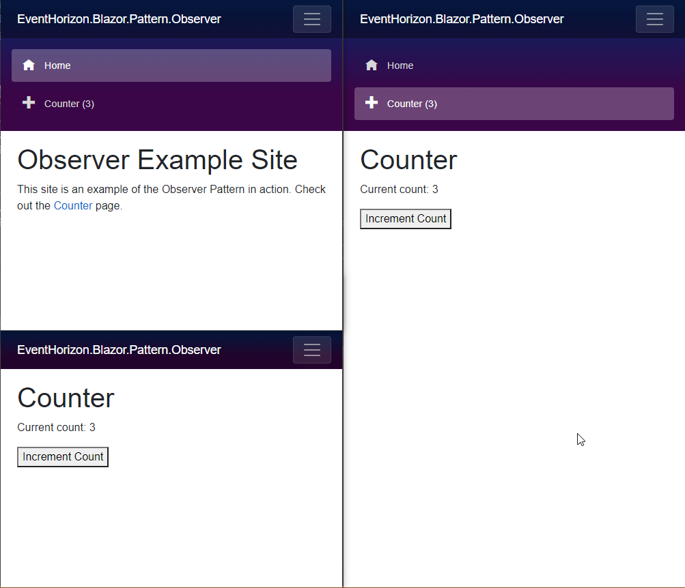

# About

This is a project showing how the Observer Pattern can be used in a Blazor application to trigger changes across the page and even other browsers.

# Project

Checkout the EventHorizon.BlazorPattern.Observer Project for an example of the usage of the EventHorizon.Observer project, that encapsulates a Task based Observer patterned library.

# Example

Image showing cross browser updating of a count state.
